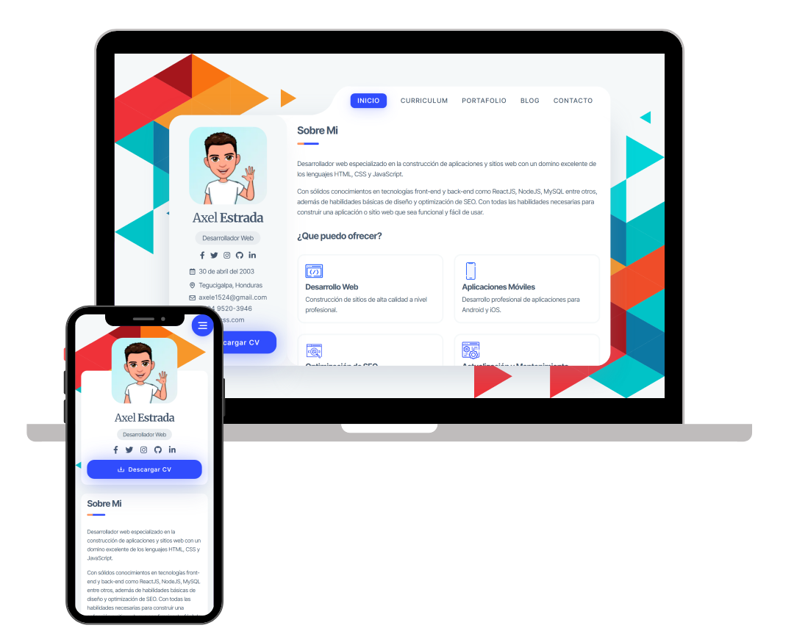

# Axel Estrada - Portafolio



- [Descripción General](#descripción-general)
- [Desafíos](#desafíos)
- [Desarrollo](#desarrollo)
- [Despliegue](#despliegue)

## Descripción General

Este proyecto tienen como finalidad dar a conocer algunos de los proyectos mas relevantes en los que he trabajado, asi como información detallada sobre quien soy y a que me dedico. Para la construcción del mismo utilicé [NextJS](https://nextjs.org/) el cual es un Framework de Javascript que permite crear fácilmente sitios web de [React](https://reactjs.org/) listos para salir a producción.

### Principales Características

- Diseño basado en tarjetas
- Currículum integrado
- Potafolio con proyectos destacados
- Formulario de contacto 100% funcional

## Desafíos

### Iconos SVG

Uno de los primeros desafíos a loa que me enfrente fue cuando quise usar imagenes `.svg` directamente en el sitio web. Al principio intente usar el elemento `Image` de NextJS pero al ser unicamente iconos decorativos me resultaba poco factible agregar un atributo `alt` a cada icono para evitar problemas de SEO.

Luego decidi utilizar [FontAwesome](https://fontawesome.com/) para importar iconos svg directamente y creando mis propios iconos personalizados cada que era necesario, ya que a pesar de que FontAwesome cuenta con muchisimos iconos necesitaba más de alguno que no estaba incluido en el paquete, por lo que recurri a crear los míos propios y luego importarlos utilizando su misma interfaz

### Curriculum y Experiencia Laboral

Al ser autodidacta y no contar con estudios universitarios, me resultaba dificil crear un curriculum que logrará llamar la atención por lo que decidi poner un apartado con unas certificaciones de cursos que tome en [freeCodeCamp](https://freecodecamp.org) y las habilidades que mejor manejo en cuanto a desarrollo web se refiere.

Aunque el resultado final me gustó bastante, me hubiese gustado agregar un apartado de experiencia laboral, pero al no contar con experiencia demostrable en alguna empresa decidi dejarlo así por el momento.

### Portafolio

A pesar de que llevo casi 2 años estudiando desarrollo web, no contaba con proyectos que yo considerara relevantes para ponerlos en esta sección, por lo que decidí crear algunos proyectos utilizando diferentes tecnologías poniendo en práctica las habilidades mencionadas en el curriculum para posteriormente agregarlos aquí.

### Blog

Este es un apartado en el cual quiero hacer un blog sobre técnicas y conceptos de css, en este momento el desarrollo del blog se encuentra en pausa, sin embargo, espero reanudarlo lo más pronto posible ya que tengo planeado sacarlo a producción a finales de septiembre de este año.

### Nodemailer y Apps Menos Seguras

Cuando intente hacer funcionar el formulario de contacto me topé con mas de un problema y el principal era que al momento de autenticar la cuenta de Gmail utilizando el paquete `nodemailer` surgia el problema de que google bloqueaba el acceso por reconocer a este servicio como una app poco segura.

Hace unos meses hubiera bastado con marcar la opción Permitir el Acceso de Apps Menos Seguras en la configuracion de Google, sin embargo, hoy esa característica ha sido deshabilitada.

Para solucionar este problema encontré un artículo de [GeeksforGeeks - How to send email using Node.js ?](https://www.geeksforgeeks.org/how-to-send-email-using-node-js/) el cual recomienda usar la autenticación OAuth2 para autenticar la cuenta de Gmail haciendo uso de [OAuth playground](https://developers.google.com/oauthplayground/) con lo cual conseguí autenticar corectamente la cuente y que todo funcionara perfectamente.

### SEO

Para ayudarme con el tema de SEO utilice el servicio [Woorank](https://www.woorank.com/) el cuál me ayudo muchisimo a identificar los puntos débiles de mi sitio web en cuanto a posicionamente en motores de busqueda.

## Desarrollo

Para llevar a cabo este proyecto utilicé:

- [NextJS](https://nextjs.org): Decidi usar este por encima de React ya que queria que el sitio estuviera optimizado para SEO algo que únicamente con ReactJS es imposible, además de esto queria familiarizarme más con este framework y aprender a hacer `deploy` en este caso utilizando [Vercel](https://vercel.com)

- [Typescript](https://www.typescriptlang.org/): Queria tener una estructura sólida y escalable por lo que decidi usar NextJS junto a Typescript logrando así un producto final mucho más robusto.

- [SASS](https://sass-lang.com/): También decidi que no queria utilizar ningun Framework CSS y poner a prueba mis habilidades con CSS utilizando unicamente el preprocesador SASS el cual me soluciono la vida al momento de escribir todos los estilos necesarios.

- [Formik](https://formik.org/): Para crear el formulario de contacto utilice Formik para manejar las validaciones de datos del lado del cliente de una masnera más facil y rápida.

- [FontAwesome](https://fontawesome.com): Para los iconos que necesitaba en el proyecto hice uso de FontAwesome utilizando algunos iconos que trae el paquete por defecto y creando los mios personalizados cuando así fue requerido.

- [Nodemailer](https://nodemailer.com/): Utilizado para enviar un email con las datos y el mensaje del usuario desde el formulario de contacto haciendo uso de la api que proporciona NextJS

## Despliegue

Para desplegar la aplicación utilice el servicio de [Vercel](https://vercel.com) el cuál es muy fácil e intuitivo de usar. Para el proveedor de dominio utilice [Freenom](https://freenom.com) con el cual pude conseguir un dominio con extensión `.ml` totalmente gratuito por 12 meses.

### Como Instalar

Para comenzar, simplemente clone este repositorio. Necesitará `node.js` y `git` instalados globalmente en su computadora.

Ejecute

```bash
npm install
```

```bash
npm run dev
```

Abra http://localhost:3000 con su navegador para ver la aplicación.
